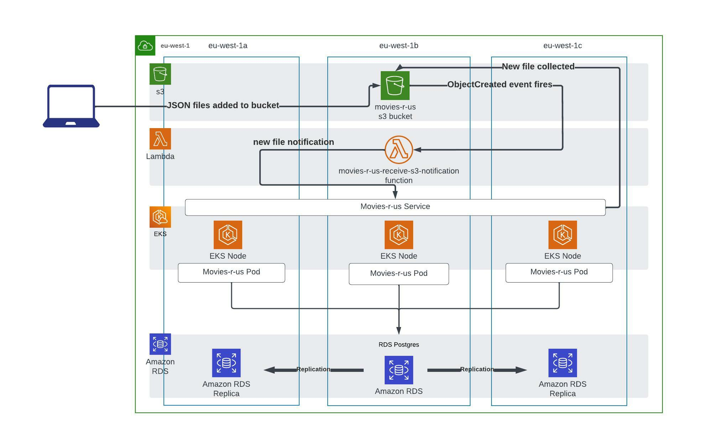

# Movies-r-us

Movies-r-us is a little setup that takes files from s3, and loads them into a database for querying via a REST API.

## Design Decisions

- Be event driven. As ingress/egress in cloud has a cost attached, only push/pull data when required, rather than poll for changes.
- Be fault tolerant within a region by running across three availability zones.
- Use cloud managed services wherever possible.
- Use one source for data types/structure.

## Contents

`./rest-api` - the API application.
`./helm` - Helm chart to deploy the containerised `rest-api`.
`./lambda` - Lambda function that receives events from s3 object creations, and sends a notification onto the `rest-api` running in k8s.
`./terraform` - Terraform of RDS, K8s, Lambda function, s3 bucket, s3 bucket event notification config.


## Dependencies
### Software

- Terraform
- Helm
- Kubectl
- Docker (to build `rest-api` image)
- AWS CLI
- AWS creds configured in `~/.aws/credentials`

### Infra

- k8s
- RDS
- s3
- Lambda

## Setup

1. Deploy `infrastructure/1-eks` with eksctl - `eksctl create cluster -f config.yml`
2. Set up kubectl - `aws eks update-kubeconfig --region eu-west-1 --name movies-r-us-cluster` and check connectivity with `kubectl get svc`
3. Set up the AWS Load Balancer Controller - https://docs.aws.amazon.com/eks/latest/userguide/aws-load-balancer-controller.html
4. Deploy `infrastructure/2-rds` with terraform, taking care to set `vpc_id` and `subnet_ids` to those created by step 1. Run `terraform output -json` to get database credentials
5. Update `helm/movies-r-us/values.yaml` with database details and deploy `helm/movies-r-us` - `helm install . --name movies-r-us-rest-api -f values.yaml`
6. Deploy `infrastructure/3-s3-lambda`, taking care to set `movies_r_us_notify_api_url` to the URL of the `rest-api` application running on k8s.


Alternatively, spin up a local Postgres, build the `rest-api` Dockerfile and play locally :)

## General Info

### Incoming Data Flow

- Files are dropped into an s3 bucket
- The s3 bucket fires an event at a Lambda function when puts occur (saving continual polling and £££).
- The Lambda function unpacks the event, and pushes the filename and bucket onto the `rest-api` application running on k8s.
- The `rest-api` application pulls the new file from s3, and attempts to bind the json to a known data structure, and saves it into a Postgres database if successful.

### s3

The bucket is configured to generate an event notification whenever an object is created. The notifications target a Lambda function. Data is assumed to be in the following format:

```
[
    {
        "title": "National Treasure",
        "year": 2004,
        "cast": [
            "Nicolas Cage",
            "Diane Kruger",
            "Justin Bartha",
            "Jon Voight",
            "Harvey Keitel",
            "Sean Bean",
            "Christopher Plummer"
        ],
        "genres": [
            "Adventure"
        ]
    }
]
```
Receiving single or multiple movies as a JSON array is supported.

### Lambda Function

When events are received from the s3 bucket, the function unpacks the event and sends a JSON payload in the following format to `MRU_API_URL`:

```
{
    "bucket": "movies-r-us",
    "key": "movies.json"
}
```

### Rest API

The `rest-api` receives notification about new files from the Lambda function. The files are collected and attempted to be unmarshalled into the expected data format. If successful, they're written to a Postgres RDS database.

The `rest-api` is configured with the following environment variables:

```
MRU_DB_HOST=<hostname>
MRU_DB_USER=<username>
MRU_DB_PASS=<password>
MRU_DB_NAME=<database_name>
AWS_REGION=<aws_region>
```

Movies can be queried at the application url `/movies`, using the query strings of `title`, `year`. `genre` and `actor`. E.g:

```
http://app_hostname/movies?title=The%20Incredibles
http://app_hostname/movies?actor=bob
http://app_hostname/movies?year=2016
http://app_hostname/movies?genre=action
```

Queries can be combined for a more specific search:

```
http://app_hostname/movies?year=2016&genre=action
```

Movie JSON can also be posted into `/movies` for testing.

## Architecture

[](./movies-r-us-architecture.jpg)
